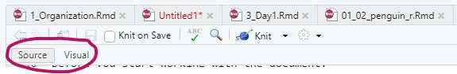
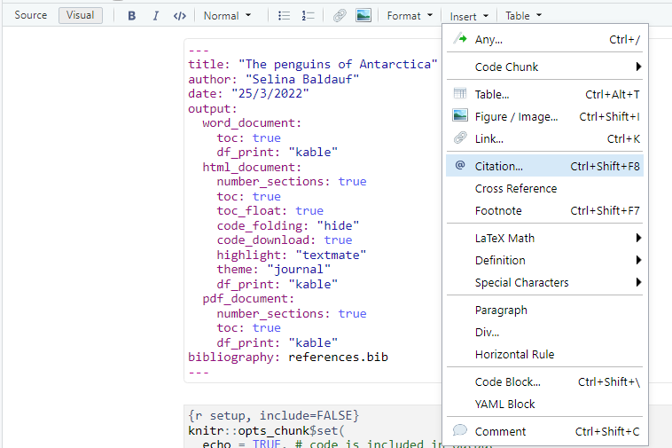
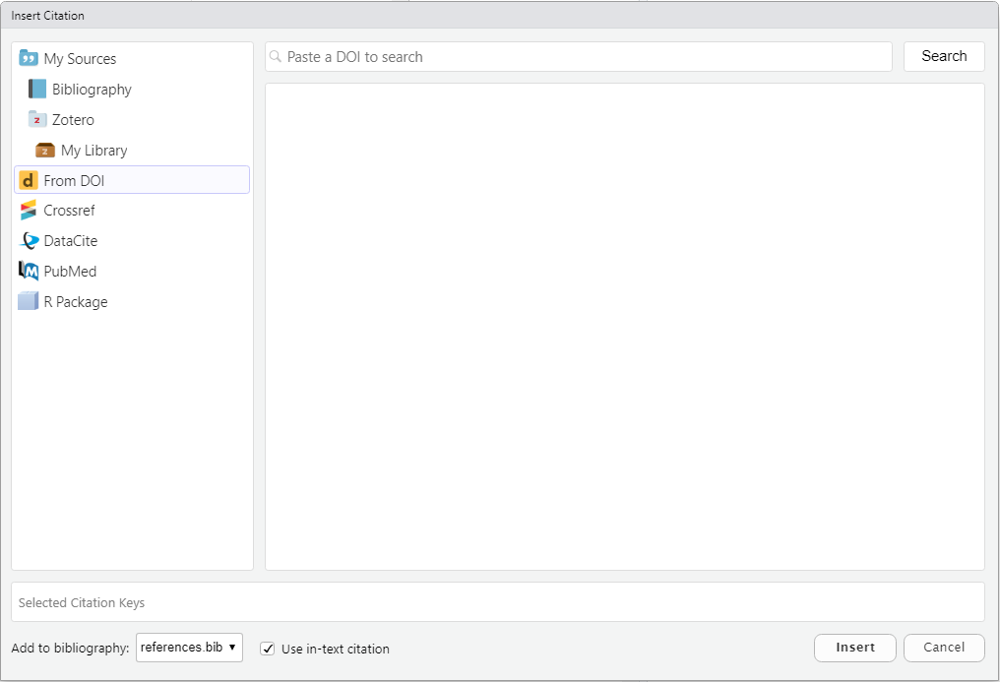

```{r setup, include=FALSE}
knitr::opts_chunk$set(echo = TRUE,
                      warning = FALSE,
                      message = FALSE)
library(fontawesome)
library(palmerpenguins)
library(xaringanExtra)
xaringanExtra::use_panelset()
```

```{r child="title_slide.Rmd"}

```


---

# Topics today

- Visual editor in RStudio

- Citations 

- Make tables look nice

- Some more tips and good practice

---

# The visual editor in RStudio

- WYSIWYG editor (*What you see is what you get*)

  - More similar to Word etc. but with less functionality
  
--
  
- Click on the button on the top left



--

- Very helpful in the beginning until you remember how everything works in markdown

- Especially helpful for markdown tables and citations

--

- But careful: Can reformat the `.Rmd` file a bit, so sometimes if you switch back 
it can look different than before.

  - Best to choose the editor you like most and stick with it


---

# Adding citations - The classic way

Bibliographies can be included via a BibTeX data base.

--
  
- Create a `.bib` file that consists of bibliography entries
  
```bibtex
@Book{cookbook,
  title = {R Markdown Cookbook},
  author = {Yihui Xie and Christophe Dervieux and Emily Riederer},
  publisher = {Chapman and Hall/CRC},
  address = {Boca Raton, Florida},
  year = {2020},
  note = {ISBN 9780367563837},
  url = {https://bookdown.org/yihui/rmarkdown-cookbook},
  }
 ```

---

# Adding citations - The classic way

Bibliographies can be included via a BibTeX data base.

- Create a `.bib` file that consists of bibliography entries

- Add name and location of your `.bib` file as a medatada field in YAML header
  
```yaml
---
output: html_document
bibliography: references.bib
---
```

--

- Cite an article from the database with `@bib_item_name` for in text citations or
`[@bib_item_name]` for citation in brackets
  - Here, I cite `@cookbook` because it's a good book `[@cookbook]`
  - Here, I cite Xie, Dervieux, and Riederer (2020) because it’s a good book (Xie, Dervieux, and Riederer 2020)


--

- List of references used will be added to the end of the document
  - Just add a heading `# References` to end of the doc

---

# Adding citations - The classic way

- Add a custom citation style file with:

```yaml
---
output: html_document
bibliography: references.bib
csl: myrefstyle.csl
---
```

--

- Most (all?) reference managers can export your citations as a `.bib` file

---

# Adding citations - Visual editor

Citations can also be added using the **visual editor** in RStudio.

--

- Visual editor creates and updates `.bib` file automatically

--

- Search and add citations from
  - The bibliography file
  - Zotero
  - DOI
  - ...
  
---

# Adding citations - Visual editor

- Just click on the `Insert -> citation`



---

# Adding citations - Visual editor

- Select source of citation on the left (e.g. DOI, Zotero, ...)
- Click `Insert` to add citation to `bibliography.bib`




---

# Adding citations - Visual editor


- You can also start typing `@` and the editor will suggest you a list of citations that fit


---

# Adding citations - Visual editor

**Using Zotero**

- If you use Zotero on your machine, RStudio should automatically detect the installation

- If not, go to `Tools->Global Options->R Markdown -> Citations` and enter the location
of your Zotero data directory and the library that you would like to use
  - In General this should be recognized automatically
  

---
class: inverse, middle, center

# .large[Now you]

## Task 1: Add some citations (20 mins)

#### Find the task description <a href="https://selinazitrone.github.io/rmarkdown/tasks/day2/02_01_penguin_citation.html">here</a>


---
class: inverse, middle, center

# .large[Nice looking tables in R Markdown]

---

# Nice looking tables with R Markdown

- The default for printing tables looks the same as printing it in the console:

```{r include=FALSE}
library(dplyr)
iris_sum <- iris %>% 
  group_by(Species) %>% 
  summarize(
    Sepal.Length = mean(Sepal.Length, na.rm = TRUE),
    Sepal.Width = mean(Sepal.Width, na.rm = TRUE),
    Petal.Length = mean(Petal.Length, na.rm = TRUE),
    Petal.Width = mean(Petal.Width, na.rm = TRUE)
  )
```
```{r}
iris_sum
```
- This is not really nice for documents

---

# `knitr::kable()`

Simple to use table generator from the `knitr` package.

```{r}
knitr::kable(iris_sum) # or iris_sum %>% knitr::kable()
```

--

- Chose `kable` as default table printing in YAML header:

```yaml
df_print: "kable"
```

--

- `kable` works for PDF, HTML and Word output

---

# `knitr::kable()`

Add arguments for additional formatting:

```{r eval=FALSE}
kable(x,
  format,
  digits = getOption("digits"),
  row.names = NA,
  col.names = NA,
  align, caption = NULL,
  label = NULL,
  format.args = list(),
  escape = TRUE, ...
)
```

- See [here](https://bookdown.org/yihui/rmarkdown-cookbook/kable.html) for many examples
many different use cases

---

# `knitr::kable()`

**Example:**

```{r}
knitr::kable(
  iris_sum,
  digits = 1,
  col.names = c("Species", "Sepal Length", "Sepal Width", "Petal Length", "Petal Width"),
  caption = "Summary of the Iris data",
  align = "l"
)
```

---

# The `{kableExtra}` package

- Provides options for table styling for HTML and PDF tables

--

- Most of the features work for both HTML and PDF tables

- Find the full documentation [here](https://haozhu233.github.io/kableExtra/)
  - If you use tables a lot, I recommend looking through the documentation to see
  all possibilities

--

- Load the packages in the setup chunk before using them

```{r}
library(knitr)
library(kableExtra)
```

--

- **Careful:** Don't load `kableExtra` for `word_document` output. This will break 
the tables made with `kable`

---

# The `{kableExtra}` package

**`kable_styling()`** is the basic styling function

- Use the pipe operator (`%>%`) to pipe `kable()` output to styling function `kable_styling()`
  - Use the keyboard shortcut ` Ctrl/Cmd + Shift + M ` to insert ` %>% `

--

```{r}
iris_sum %>% 
  kable() %>%
  kable_styling(
  full_width = FALSE, # display table on full page width?
  position = "center",  # if not full width -> where to put table
  font_size = 15
)
```

---

# The `{kableExtra}` package

**`kable_styling()`** provides styling options

- Additional styling options for HTML output are passed via `bootstrap_options`

--

```{r eval=FALSE}
iris_sum %>% 
  kable() %>%
  kable_styling(
  full_width = FALSE, # display table on full page width?
  position = "center",  # if not full width -> where 
  font_size = 15,
  bootstrap_options = c("striped", "hover") #<<
)
```

```{r echo=FALSE}
iris_sum %>% 
  kable() %>%
  kable_styling(
  full_width = FALSE, # display table on full page width?
  position = "left",  # if not full width -> where 
  font_size = 15,
) |> 
  kable_classic(c("hover", "striped"))
```

---

# The `{kableExtra}` package

**`kable_styling()`** provides styling options

- Additional styling options for PDF output are passed via `latex_options`

```{r eval=FALSE}
iris_sum %>%
  kable(booktabs = TRUE) %>%  #<<
  kable_styling(
    full_width = FALSE,
    position = "center", 
    font_size = 15,
    bootstrap_options = c("striped", "hover"),
    latex_options = c("striped", "hold_position", "scale_down") #<<
  )
```

- `booktabs = TRUE` will use the `booktabs` LaTeX package to create nice horizontal lines and removes vertical lines
- `hold_position` places the table where it is created in the document (no floating)
- `scale_down` scales the text down to fit the table width

---

# The `{kableExtra}` package

**`kable_styling()`** provides styling options

- Additional styling options for PDF output are passed via `latex_options`

```{r eval=FALSE}
iris_sum %>%
  kable(booktabs = TRUE) %>%  #<<
  kable_styling(
    full_width = FALSE,
    position = "center", 
    font_size = 15,
    bootstrap_options = c("striped", "hover"),
    latex_options = c("striped", "hold_position", "scale_down") #<<
  )
```

- Depending on the output format you chose, `bootstrap_options` or `latex_options` will be ignored

---

# The `{flextable}` package

--

- Works with PDF, HTML and Word output
  - Can be used as an option to style tables in Word

- Alternative to `kable` and `kableExtra`

- See [here](https://ardata-fr.github.io/flextable-book/index.html) for an extensive documentation
of the flextable package

---
class: inverse, middle, center

# .large[Now you]

## Task 3: Create a nice table (20 mins)

#### Find the task description <a href="https://selinazitrone.github.io/rmarkdown/tasks/day2/02_02_penguin_tables.html">here</a>
