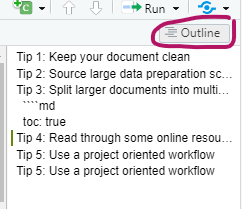
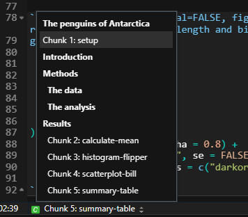

```{r setup, include=FALSE}
knitr::opts_chunk$set(echo = TRUE,
                      warning = FALSE,
                      message = FALSE)
library(fontawesome)
library(palmerpenguins)
```

```{r child="title_slide.Rmd"}

```


---

# Tip 1: Keep your document clean
  
`.Rmd` documents can quickly become large and messy. To keep them clean, you can

--

.pull-left[
  
- Use headers to mark sections in your document
- Navigate the file using the document outline]

.pull-right[

.center[]
]

--

.pull-left[
  
- Use names for your code chunks
- Navigate code chunks with the code and document outline (bottom left of script)]

.pull-right[

.center[]
]

---
  
# Tip 2: Source large data preparation scripts
  
- If it's not necessary for the document, do data preparation in a separate R Script

- Place that R Script in the project where the `.Rmd` is located

- Then source the script in a code chunk:

--

````md
`r ''````{r prepare-data, warning=TRUE, message=TRUE}
source("path/to/script.R")
```
````

--

- This runs all the R code in `script.R` and loads the results into the `.Rmd` document

---
  
# Tip 2: Source large data preparation scripts

.pull-left[

- Use R scripts to read in data, clean it, summarize it, ...
- Store the clean and summarized data in an R object
- Source the R script in your R Markdown file to use the summarized object


R script `summarize_data.R` in a subfolder `R` in the project:

```{r eval=FALSE}
library(palmerpenguins)
penguin_summary <- penguins %>% 
  filter(!(is.na(sex))) %>% 
  group_by(species, sex) %>% 
  summarize(
    bill_length = mean(bill_length_mm,
    na.rm = TRUE),
    bill_depth = mean(bill_depth_mm,
    na.rm = TRUE)
  )
```
]

--

.pull-right[

````md
---
title: "My paper"
author: "Selina Baldauf"
output: 
  pdf_document:
    toc: true
---

```{r global-setup, include = FALSE}`r ''`
knitr::opts_chunk$set(echo = FALSE)
source("R/summarize_data.R")
```

# Introduction

# Methods

# Results

```{r summary-table}`r ''`
penguin_summary %>% 
  knitr::kable()
```

````

]

---

# Tip 3: Split larger documents into multiple `.Rmd` files

- Write separate `.Rmd` files e.g. for Introduction, Methods and Results

--

- Have on main `.Rmd` file that
  - Combines the sections into one
  - Controls YAML options of the output
  
--

- You can load an `.Rmd` file into another one using the `child` chunk option

````md
`r ''````{r load-child, child="path/to/child.Rmd"}
```
````

---

# Tip 3: Split larger documents into multiple `.Rmd` files


.pull-left[

- 3 separate files `Introduction.Rmd`, `Methods.Rmd`, `Results.Rmd`

- The separate files control everything that happens on the lower levels of the documents, e.g.

````md
## First results

`r ''````{r result-plot, fig.width=3}
plot(1:10, 1:10)
```
````

- `Main.Rmd` (see right) controls
  - YAML options 
  - Global setup options
  - Includes the sections via the `child` option
  

]

--

.pull-right[

````md
---
title: "My paper"
author: "Selina Baldauf"
output: 
  pdf_document:
    toc: true
---

```{r global-setup, include = FALSE}`r ''`
knitr::opts_chunk$set(echo = FALSE)
```

# Introduction

```{r intro, child="Introduction.Rmd"}`r ''`
```

# Methods

```{r methods, child="Methods.Rmd"}`r ''`
```

# Results

```{r results, child="Results.Rmd"}`r ''`
```

````

]

---

# Tip 4: Read through some online resources

- Read or scroll through some R Markdown books or tutorials to
  
  - See what is possible with R Markdown
  - Find thing that are relevant for your own documents

- I recommend to start with the two books:
  - [R Markdown Cookbook](https://bookdown.org/yihui/rmarkdown-cookbook/)
  - [R Markdown - The Definitve Guide](https://bookdown.org/yihui/rmarkdown/)
  
- You can also find some <a href="https://selinazitrone.github.io/rmarkdown/online_resources.html">resources on the workshop website</a>

---
class: inverse, middle, center

# .large[Two more advanced tips and tricks]

---

# 1 - Render your document from an R script

- Use the `render()` function from the `rmarkdown` package to render your documents instead of using the `Knit button`

--

**Why?**

- Reproducibility -> Everything that you do manually and not by code cannot
necessarily be reproduced by someone else
- Allows you do easily control and manipulate document options
- Easy automation of report creation (see next tip)

--

- Call the help function on `render` to see all options

```{r eval=FALSE}
library(rmarkdown)
?render
```

---

# 1 - Render your document from an R script

Render into **all output formats** defined in the `.Rmd` file:

```{r eval=FALSE}
render(input = "my_paper.Rmd", 
       output_format = "all")
```

--

Render into a **specific output format**:

```{r eval=FALSE}
render(
  input = "my_paper.Rmd",
  output_format = "html_document"
)
```

--

Put the output in a separate directory (default is same directory as `.Rmd` file)

```{r eval=FALSE}
render(
  input = "my_paper.Rmd",
  output_format = "html_document",
  output_dir = "final_reports" # put output into a folder called final_reports
)
```

---

# 1 - Render your document from an R script

Overwrite the document options set in the `.Rmd` file

```{r eval=FALSE}
render(
  input = "my_paper",
  output_format = "html_document",
  output_dir = "final_reports",
  output_options = list(
    toc = TRUE,
    toc_depth = 2
  )
)
```

---

# 2 - Parameterized reports

**Situation**: You want the **same report** (same text, formatting, plots, statistics, ...) for **different inputs**

--

**Basic idea**

- Write an `.Rmd` file for your report
- Use parameters to adress the variable input for your report
  - e.g. different data input files, different subset of the data, ...
- Use the render function to render your report for a specific set of input parameters.

--

- Parameters are passed as a list to the document and can be accessed via the `params` variable
  - Just use `$` to access specific parameters

---

# 2 - Parameterized reports

````md
---
title: "Summary for the `r params$species` penguin"
output: html_document
params:
  species: "Adelie"
---

```{r }`r ''`
library(palmerpenguins)
```

# Introduction

```{r}`r ''`
mean_mass <- penguins %>% filter(species == params$species) %>%
  pull(body_mass_g) %>% mean(na.rm = TRUE) 
```

The mean body mass of the `r knitr::inline_expr("params$species")` penguin is `r knitr::inline_expr("round(mean_mass, 0)")` g.

```{r}`r ''`
penguins %>% 
  filter(species == params$species) %>% 
  ggplot(aes(x = body_mass_g)) +
  geom_histogram()
```

````

---

# 2 - Parameterized reports

Render the report only for the Chinstrap penguins:

```{r eval=FALSE}
render(
  input = "penguins_parameterized.Rmd",
  output_file = "Chinstrap_report.html",
  params = list( #<<
    species = "Chinstrap" #<<
  ) #<<
)
```

--

Or render 3 reports for the 3 penguins in a for loop

```{r eval=FALSE}
for(x in c("Adelie", "Chinstrap", "Gentoo")){ # loop over all penguin species
  render(
    input = "penguins_parameterized.Rmd",
    output_file = paste0(x, "_report.html"), # give every output a separate filename
    params = list(
      species = x
    )
  )
}
```


