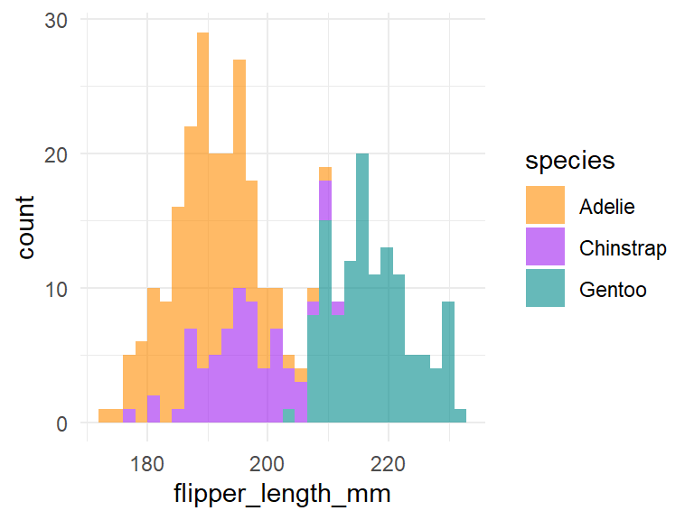

## Introduction

There are some penguin species Antarctica that, you can see them in the following figure:

](https://github.com/allisonhorst/palmerpenguins/blob/master/man/figures/lter_penguins.png?raw=true)

## Methods

### The data

The data that will be analysed in this document was collected on islands in Antarctica and
published by Gorman et al. (2014) in PLoS ONE. You can find the original paper with the 
title "Ecological sexual dimorphism and environmental variability within a community of Antarctic penguins (genus *Pygoscelis*)"^[paper available [here](https://doi.org/10.1371/journal.pone.0090081).]

The data is also published via the `palmerpenguins` R package which you can find [on this website](https://allisonhorst.github.io/palmerpenguins/).

**The data contains the following measurements:**

- bill length
- bill depth
- flipper length
- body mass
- sex
  - male
  - female

### The analysis

We conduct the following analysis:

1. Plot some plots of the data
2. Calculate some summary statistics and print them in a table
3. Calculate a linear model of the form $y = ax + b + \epsilon$


## Results

The mean flipper length of all penguin species is 200.9152047 ($\pm$ 200.9152047). 


The Gentoo species has the highest flipper length (mean 217.1869919), followed by 
the Chinstrap species (mean 195.8235294). The Adelie species as the lowest
average flipper length (mean 189.9536424).


```r
ggplot(penguins, aes(x = flipper_length_mm, fill = species)) +
  geom_histogram(alpha = 0.6) +
   scale_fill_manual(values = c("darkorange", "purple", "cyan4")) +
  theme_minimal()
```

<div class="figure" style="text-align: center">

<p class="caption">Histogram of the three penguin species.</p>
</div>

There is a positive relationship between bill length and bill depth for all 3 species, as the figure below shows.


```r
ggplot(
  data = penguins,
  aes(
    x = bill_length_mm,
    y = bill_depth_mm,
    color = species,
    shape = species
  )
) +
  geom_point(size = 3, alpha = 0.8) +
  geom_smooth(method = "lm", se = FALSE) +
  scale_color_manual(values = c("darkorange", "purple", "cyan4")) +
  theme_minimal()
```
In general, it looks like the body characteristics differ between the sexes but also between the penguin
species, as the table below illustrates:


```r
penguins %>% 
  filter(!(is.na(sex))) %>% 
  group_by(species, sex) %>% 
  summarize(
    bill_length = mean(bill_length_mm, na.rm = TRUE),
    bill_depth = mean(bill_depth_mm, na.rm = TRUE),
    flipper_length = mean(flipper_length_mm, na.rm = TRUE),
    body_mass = mean(body_mass_g, na.rm = TRUE)
  )
```

```
## # A tibble: 6 x 6
## # Groups:   species [3]
##   species   sex    bill_length bill_depth flipper_length body_mass
##   <fct>     <fct>        <dbl>      <dbl>          <dbl>     <dbl>
## 1 Adelie    female        37.3       17.6           188.     3369.
## 2 Adelie    male          40.4       19.1           192.     4043.
## 3 Chinstrap female        46.6       17.6           192.     3527.
## 4 Chinstrap male          51.1       19.3           200.     3939.
## 5 Gentoo    female        45.6       14.2           213.     4680.
## 6 Gentoo    male          49.5       15.7           222.     5485.
```

