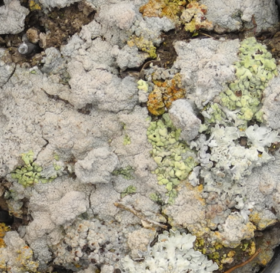
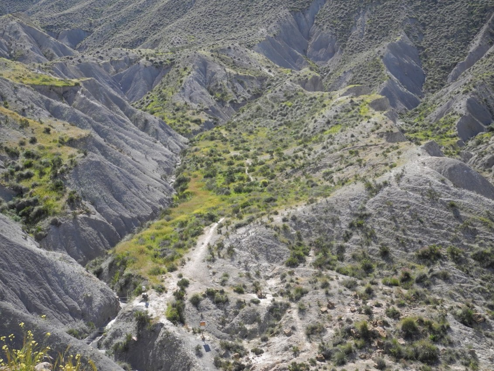

```{r setup, include=FALSE}
knitr::opts_chunk$set(echo = TRUE,
                      warning = FALSE,
                      message = FALSE)
library(fontawesome)
```

```{r child="title_slide.Rmd"}

```

---

# Who am I?

.pull-left[

- Scientific modeller with ecology background

- Working in the [theoretical ecology group](https://www.bcp.fu-berlin.de/biologie/arbeitsgruppen/botanik/ag_tietjen/index.html) at Freie Universität

- PhD student at Freie Universität Berlin 
  - Topic: Modelling the impact of biological soil crusts on dryland hydrology

#### Teaching `r fa("r-project")`

- Statistics with R for Biology Master students
- Workshop "Introduction to Data analysis with R"
- Workshops on R packages, R development, ...
]

.pull-right[
.center[
<br><br>

]
]

---
# The Workshop: Topics

.pull-right[.center[]]
.pull-left[

- **Day 1: Introduction to the R Markdown package**
  
  - What is it? 
  - What can you do with it?
  - Basic functionality
  
- **Day 2: More advanced features and other document types**
  - Citations
  - Additional output types
  - Format tables
  
- **Day 3: Bring your own data**
  - Optional
]


.footnote-right[Artwork by [Allison Horst](https://twitter.com/allison_horst)]

---
# The Workshop: Schedule and Organization

🕘 1 p.m. - 5 p.m. <br>
📍  We will meet in the `General` meeting on Webex

--

#### Organization

- **Input sessions**
  - Presentation and demonstration of a topic
  - Some examples
  
- **Tasks** regarding this topic
  - In groups: You can start a meeting in the groups or use the chat
  
- **Joint discussion** of tasks and additional questions

---
# The Workshop: Material

- All material can be found on the [workshop's website](https://selinazitrone.github.io/rmarkdown/)

  - Presentations
  - Tasks
  - Solutions
  - Additional resources
  
---
# Bring your own data

--

#### Learning by doing

- Create your own documents

  - Use methods learned in the course
  - Try something new
  - Create the document that you actually need or want to learn

--

- It is optional
  - Think about it and let me know tomorrow afternoon if you want to participate
  - If you already know: add your name to the [joint document](https://hackmd.io/XdORDPAlQsqMu1VNJsRfbw?both)
  
--

- If you want to try something specific: Let me know and I can check for resources/packages/examples etc. before

---

# Before we get started I

Any feedback and questions are very welcome.

I am curious to know

- What you liked/disliked
- If the time was enough for the tasks
- If you missed some topics
- ...

---

# Before we get started II

I assume that you already know things like:

- Creating new projects or documents in RStudio

- Basic functionality of RStudio e.g. Console vs. Script, etc.

- Basics of R: concept of variables, functions, packages, ...

--

- I will use some code examples with functions from the `tidyverse` packages (`ggplot2`, `dplyr`)

--

We probably all have very different R skills and levels in the group, so 
**please ask if anything needs more explanation**

--

- There are always some extra tasks for the fast ones that you can but don't have to do

---

# Before we get started III

.large[Did anyone have problems installing the R Markdown?]

---

# Feedback

Please take 5 mins to complete the feedback survey for the Graduate center (don't use Internet Explorer)

.center[https://votingo.cedis.fu-berlin.de/survey/P93BAL]

--

Please take another 5 mins to complete my more specific survey to further improve the course


.center[https://forms.gle/rpMtG843dT9pSNmu7]

---
# Feedback and Questions


- Any other feedback/comments/questions from your side?

---
class: inverse, middle, center

# .large[The End]
## Thanks a lot for participating!


.footnote-right[Artwork by [Allison Horst](https://twitter.com/allison_horst)]