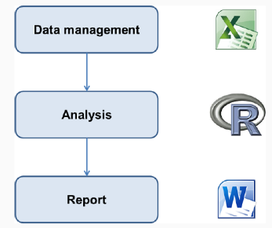

```{r setup, include=FALSE}
knitr::opts_chunk$set(echo = TRUE,
                      warning = FALSE,
                      message = FALSE)
library(fontawesome)
```

```{r child="title_slide.Rmd"}

```

---
# A standard workflow



---
# A standard workflow

With this workflow, it's hard to answer questions such as:

- How did you produce this figure? What is the analysis behind it?
- What data did you use? Which data points were left out?
- Where does this value come from?

---
# The situation

This workflow has many problems:

- If there is an error and you have to repeat the analysis
  - Update all the figures and tables in Word document
- Manual copy pasting of value from the analysis in to the Word document
  - Annoying
  -**Very** error prone -> Did you update all the values after redoing the analysis?
  
---
# The solution

.center[]

---
# Basic Idea of Rmarkdown


- text + code + metadata
- knit everything togehter
- convert into desired output format
  - HTML
  - Pdf
  - word
  - ...
  
---
# Rmarkdown universe

- Many packages that provide additional functionality

.center[ ...]

---
# Motivation

- Reproducibility
- Documentation and Code + Output in one place
- Use R pipeline to produce documents 
  - parameterized reports
- No more copy pasting -> If you have to redo your analysis
  - Copy numbers from R to a word doc table
- Fun

---
# Use cases

**"Basic"**

- Lab reports
- Documentation of analysis for supervisors
- Publications
- ...

**"Advanced"**

- Presentations
- Websites
- Books
- ...

---
# The basic workflow

- Create an empty `.Rmd` document
- Write the document
- Render the document to the preferred output format (so called knitting)
  
.center[]

---
# Basic workflow in practice

**Step 1: Create an empty `.Rmd` document**

- From scratch: Create a new file in RStudio and save it with file ending `.Rmd`
- From a template:
  - Rmarkdown itself comes with some templates
  - Additional packages come with additional packages
    - rticles for article templates
    - xaringan for presentations ...
  - `File` -> `New File` -> `Rmarkdown...` 
  
---
# Basic workflow in practice

**Step 1: Create an empty `.Rmd` document**

.pull-left[
- Select template
- Add title and author metadata 
  - can also be left blank and done later
- Select output format
]

.pull-right[

]

---
# Basic structure of an Rmarkdown document


---
# Basic structure of an Rmarkdown document

**Meta data**

- On top of the document
- Enclosed in `---`
- Contains metadata in YAML Syntax

**Text in Markdown syntax**

- Document text body
- Anywhere in the document
- Markdown syntax

**R code in Code chunks**

- Contains any R code that should be used in the document
- Encolsed in 

```
```{r}
# here the code
```
```

---
# Basic workflow in practice

**Step 2: Write your document**

- Metadata
- Text 
- R code


---
# Basic workflow in practice

**Step 3: Render the document to the desired output format**

- This proesses is called **rendering** or **knitting**
- Knitr uses pandoc to transform documents 
- `.Rmd` -> Rmarkdown -> Knitr -> pandoc -> pdf, html, word ...
- Click the `knit` Button
- Use the keyboard shortcut `Ctrl/Cmd + Shift + K`
- For more options, click the little arrow next to the `Knit` button


Document is knitted in a new R session -> This is desired because it makes sure that the document is reproducible and that there is no object missing

---
# Basic workflow in practice

- Iterate through steps 2 and 3 more often and not just once in the end

---
class: inverse, middle, center

# .large[Now you]

## Task 1: Create and RStudio Project with your first Rmarkdown document

#### Find the task description <a href="../01_tasks_controller.html#first-rmarkdown-document">here</a>

---
class: inverse

# The text body: Markdown syntax

---
# The text body: Markdown

- Text body in Markdown syntax
- Markdown is simple markup language to create formatted text
- There are different flavours of markdown but the basic functionality is the same
- Rmarkdown uses pandoc's markdown syntax
  - Find a full documentation [here](https://pandoc.org/MANUAL.html#pandocs-markdown)
  
- There a many things you can do and you learn them best as you need them, but here follow the basics

---
# The text body: Markdown

**The basics**

- **bold**
- *italic*
- text~subscript
-text^superscript
- `inline code` 
- [RStudio](https://www.rstudio.com): [text](link)
- 
- ^[a footnote]

---
# The text body: Markdown

**The basics: headers**

```
# First level header
## Second level header
### Third level header
```

---
# The text body: Markdown

**The basics: lists**

- Itemized lists

```
- item 1
  - another item
- item 2
- item 3
```

- Numbered lists

```
1. item 1
2. item 2
3. item 3
```

---
# The text body: Markdown

**The basics: math expressions**

- Enclosed in `$` or `$$` and written in LaTeX syntax

$f(k) = {n \choose k} p^{k} (1-p)^{n-k}$

```
$$
$f(k) = {n \choose k} p^{k} (1-p)^{n-k}$
$$
```

---
---
# The text body: Markdown

**The basics: math expressions**

- Always use spaces around rmarkdown object so that they can be rendered correctly

---
class: inverse, middle, center

# .large[Now you]

## Task 1: Create some markdown text

#### Find the task description <a href="../01_tasks_controller.html#first-rmarkdown-document">here</a>

---
class: inverse

# The R code

---
# The R code

- R code in code chunks
- Inline R code

---
# Code chunks

- Code chunks can contain any type of R code and can produce text output, tables, figures, or just prepare a future data analysis
- Code chunks start with ```{r} and end with ```
- Insert a code chunk by going to `Code` -> `Insert chunk`
- Use the keyboard shortcut `Ctrl + Alt + I` / `Cmd + Option + I`
- Code chunks can have names

```
# an example code chunk with a name
```

- You can run code chunks also within R Studio

---
# Chunk options

- Code chunks can have options that give you fine control over the behaviour of a chunk
- See [here](https://yihui.org/knitr/options/) for a comprehensive list of all chunk options
- Chunk options separated by commas and added after R
- Some chunk options can be set by clicking on the gear icon next to the chunk

- Chunk options have default values and you can change them if you want to
- Different docuemnt outputs support different chunk options.


---
# Some important chunk options

- `eval`: Evaluate the chunk?
- `echo`: Show source code in output?

```{r results="as-is"}


```

---
# Some important chunk options

- `warning`, `message`, `error`: Show warnings or errors? boolean
- `include`: Include anything from the chunk in the output? -> Combines `echo = FALSE`, `results = "hide"`, `warwning =FALSE`, `message=FALSE`

---
# Some important chunk options

- `fig.width` and `fig.height`: size of graphical device in inches (i.e. size of the plots)
- `out.width` and `out.height`: Scale output of R plots, e.g. to scale images `out.width = "80%"`
- `fig.align`: plot alignment, one of `"left"`, `"center"`, `"right"`
- `fig.cap`: a figure caption


---

---
# The setup chunk

- Default behaviour of code chunks can be specified in a dedicated chunk in the beginning
- Name it setup chunk
- Knitr options

---
# Inline R code

- E.g. to print values of variables into the code

---
# Other language engines

Other available language engines 


```{r}
names(knitr::knit_engines$get())
```

- see [here](https://bookdown.org/yihui/rmarkdown/language-engines.html) if you are interested


---
class: inverse

# Metadata with the YAML header

---
# YAML header

- YAML Syntax: Intentation has to be correct
  - Two spaces or a tab


- For meta data
- Set output format and their options
- Many options, some specific to specific document outputs

---
#YAML header: Document metadata

- Author
- Date
- Title
- ...

---
# YAML header: Output formats

- `html_document`
- `pdf_document`
- `word_document`
- `beamer_presentation`
- `powerpoint_presentation`
- ...

---
# YAML header: Output options

- Each output format has many different options that can be specified in the YAML header
- Have a look at `?rmarkdown::pdf_document` to see all options
- Options are intented, e.g.

```
---
output: pdf_document:
  toc: true
  fig_caption: true
---
```

---
# YAML header: Output options for all document types

- `fig_caption`
- `highlight` values "tango", "kate", ...
- `toc`
- `toc_depth`


