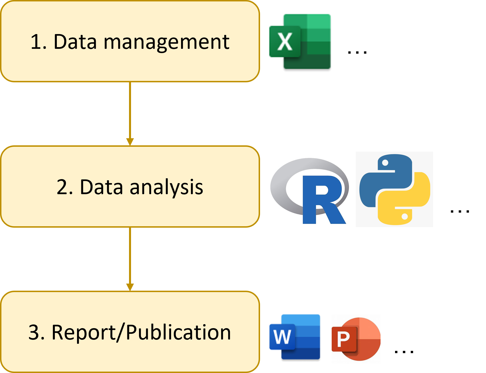
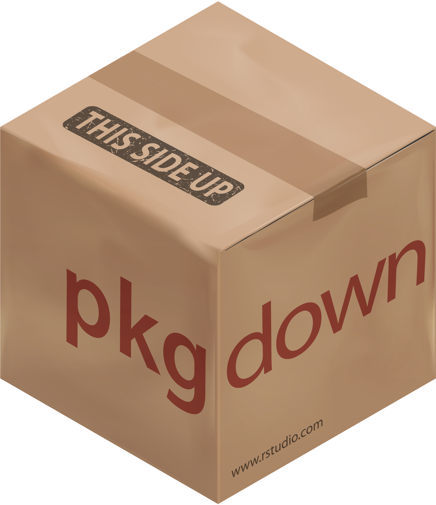
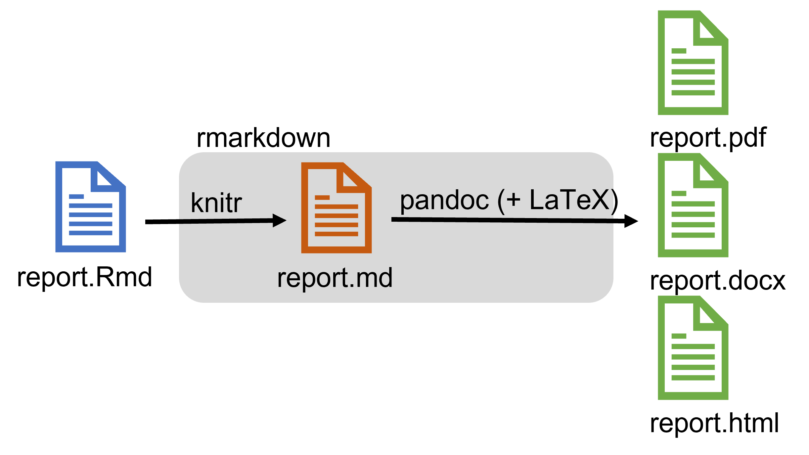
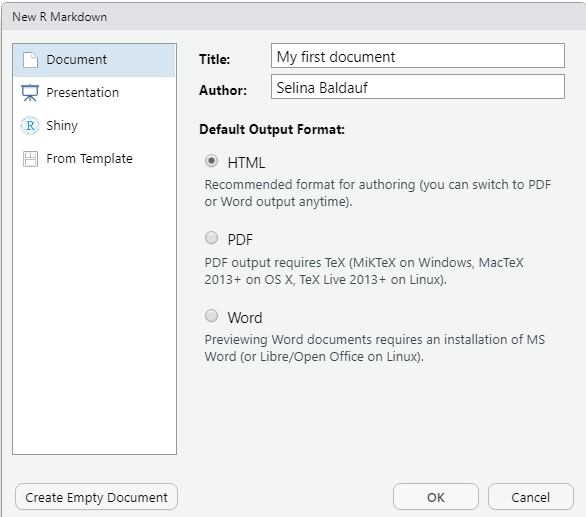
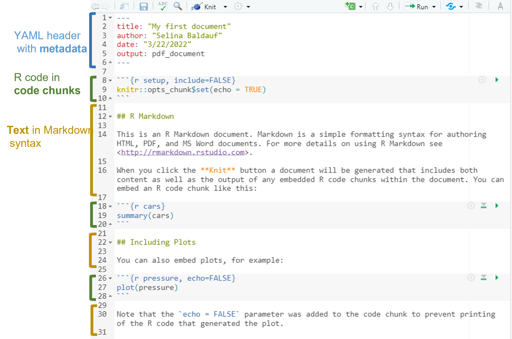
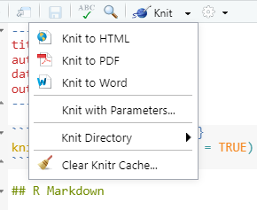
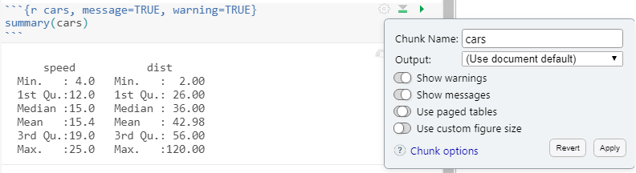

```{r setup, include=FALSE}
knitr::opts_chunk$set(echo = TRUE,
                      warning = FALSE,
                      message = FALSE)
library(fontawesome)
```

```{r child="title_slide.Rmd"}

```

---
# A standard workflow

<br>

.pull-left[
.center[]
]


--

.pull-right[

**Hard to answer questions:**

- How did you produced this figure? What analysis is behind it?

- What data did you use for this table? Did you leave any data points out?

- Were does this value come from?

- I found an error in the raw data. Can you repeat the analysis?

]

---
# A standard workflow

Main problem with this workflow: 

- **error prone** and **non-reproducible**

--

If you have to repeat the analysis

--

- Redo all figures and tables

--
  
- Update them in document and presentation manually
  
  - Manual copy pasting of values is very **error** prone
  
--
  
- Annoying and you probably have to repeat this several times

---
# Solution: A workflow using `{rmarkdown}`

.pull-left[

**Basic idea**

- Text + Code + Metadata
- Mix everything together and add code output
- Convert into desired output format
  - HTML
  - Pdf
  - Word
  - Presentations
  - ...
]

.pull-right[

.center[]

]

---
# Motivation

- Reproducibility

  - Easy to redo analysis
  - Easy to verify and check
  - No more copy pasting
  - Continuous workflow that is independent of the person that wrote the workflow
  
--

- Documentation/Text, Code & Output in one place

--

- Use R pipeline to produce documents 
  - Create an automatic workflow
  
-- 

- Fun

---
# Use cases

Any type of document, especially if it contains something produced by code: 

- Lab reports
- Documentation of analysis for yourself/supervisors/...
- Publication + Publication of analysis

--

- Presentations
- Websites
- Books
- ...

---
# The `rmarkdown` universe

- Many packages that provide additional functionality
  
  - Additional output formats
  - Templates
  - Formatting tools
  - Printing tools
  - ...
  
Just some examples:

.center[]

There are many more ...


---
# The basic workflow

.pull-left[

1. Create an `.Rmd` document 

2. Write text and R code in the document

3. Render the document to a defined output format using `rmarkdown`
  - Knit from `.Rmd` to `.md`: Use [`{knitr}`](https://yihui.org/knitr/) package, run all the code and put its
  output in the document
  - Use [pandoc](https://pandoc.org/) (+ LaTeX) to convert to `.pdf`, `.docx`, ...
  - This is all done automatically by `rmarkdown`

]

.pull-right[.center[]]

.footnote-right[Figure adapted from [BES Guides to better science: Reproducible code](https://www.britishecologicalsociety.org/wp-content/uploads/2019/06/BES-Guide-Reproducible-Code-2019.pdf)]

---
# Basic workflow in practice

**Step 1: Create a new `.Rmd` document**

- **Empty**: Create a new file in your project and save it with file ending `.Rmd`

- **From a template**:

  Rmarkdown itself comes with some templates
    - `File` -> `New File` -> `Rmarkdown...`
    
  Additional packages come with additional packages
    - [`{rticles}`](https://pkgs.rstudio.com/rticles/) for article templates
    - [`{xaringan}`](https://github.com/yihui/xaringan) for presentations ...
  
  
---
# Basic workflow in practice

**Step 1: Create a new `.Rmd` document**

.pull-left[
`File` -> `New File` -> `Rmarkdown...`

- Select template on left

- Add title and author metadata 
  - Can also be left blank and done later
  
- Select output format

- Click `OK`
]

.pull-right[

]

---
# Basic structure of an Rmarkdown document

.center[]


---
# Basic structure of an Rmarkdown document

.pull-left[

**Meta data**

- On top of the document

- Enclosed in `---`

- Contains 
  - Document metadata in YAML Syntax
  - Information on output type and options
  
]

.pull-right[

.center[]

]

---
# Basic structure of an Rmarkdown document

.pull-left[

**Text body**

- Anywhere in the document

- Markdown syntax

]

.pull-right[

.center[]

]

---
# Basic structure of an Rmarkdown document

.pull-left[

**Code chunks**

- For R code (but also other languges)

- Structure of code chunks:

````markdown
`r ''````{r}
# your R code goes here
```
````

- Can have different options

]

.pull-right[

.center[]

]

---
# Basic workflow in practice

**Step 2: Write your document**

- Metadata
- Text 
- R code

---
# Basic workflow in practice

**Step 3: Render/Knit the document to the desired output format**

.pull-left[

- `knitr` runs the code and combines it with the text

- pandoc creates the output document

- Document is knitted in a new R session
  - This makes sure that the docuement is reproducible and that it does
  not depend on the current environment

]

.pull-right[.center[]]

---
# Basic workflow in practice

**Step 3: Render/Knit the document to the desired output format**

.pull-left[

- Click the `knit` Button

- Use the keyboard shortcut `Ctrl/Cmd + Shift + K`
- For more options, click the little arrow next to the `Knit` button

]

.pull-right[.center[]]

--

`r fa("arrow-right")` Iterate through steps 2 and 3 until finished

---
class: inverse, middle, center

# .large[Now you]

## Task 1: Create and RStudio Project with your first Rmarkdown document

#### Find the task description <a href="../01_tasks_controller.html#first-rmarkdown-document">here</a>

---
class: inverse

# The text body: Markdown syntax

---
# The text body: Markdown

- Text body in Markdown syntax
- Markdown is simple markup language to create formatted text
- There are different flavours of markdown but the basic functionality is the same
- Rmarkdown uses pandoc's markdown syntax
  - Find a full documentation [here](https://pandoc.org/MANUAL.html#pandocs-markdown)
  
- There a many things you can do and you learn them best as you need them, but here follow the basics

---
# The text body: Markdown

**The basics**

- **bold**
- *italic*
- text~subscript
-text^superscript
- `inline code` 
- [RStudio](https://www.rstudio.com): [text](link)
- 
- ^[a footnote]

---
# The text body: Markdown

**The basics: headers**

```
# First level header
## Second level header
### Third level header
```

---
# The text body: Markdown

**The basics: lists**

- Itemized lists

```
- item 1
  - another item
- item 2
- item 3
```

- Numbered lists

```
1. item 1
2. item 2
3. item 3
```

---
# The text body: Markdown

**The basics: math expressions**

- Enclosed in `$` or `$$` and written in LaTeX syntax

$f(k) = {n \choose k} p^{k} (1-p)^{n-k}$

```
$$
$f(k) = {n \choose k} p^{k} (1-p)^{n-k}$
$$
```

---
---
# The text body: Markdown

**The basics: math expressions**

- Always use spaces around rmarkdown object so that they can be rendered correctly

---
class: inverse, middle, center

# .large[Now you]

## Task 1: Create some markdown text

#### Find the task description <a href="../01_tasks_controller.html#first-rmarkdown-document">here</a>

---
class: inverse

# The R code

---
# The R code

- R code in code chunks
- Inline R code

---
# Code chunks

- Code chunks can contain any type of R code and can produce text output, tables, figures, or just prepare a future data analysis
- Code chunks start with ```{r} and end with ```
- Insert a code chunk by going to `Code` -> `Insert chunk`
- Use the keyboard shortcut `Ctrl + Alt + I` / `Cmd + Option + I`
- Code chunks can have names

```
# an example code chunk with a name
```

- You can run code chunks also within R Studio

---
# Chunk options

- Code chunks can have options that give you fine control over the behaviour of a chunk
- See [here](https://yihui.org/knitr/options/) for a comprehensive list of all chunk options
- Chunk options separated by commas and added after R
- Some chunk options can be set by clicking on the gear icon next to the chunk

- Chunk options have default values and you can change them if you want to
- Different docuemnt outputs support different chunk options.


---
# Some important chunk options

- `eval`: Evaluate the chunk?
- `echo`: Show source code in output?

```{r results="as-is"}


```

---
# Some important chunk options

- `warning`, `message`, `error`: Show warnings or errors? boolean
- `include`: Include anything from the chunk in the output? -> Combines `echo = FALSE`, `results = "hide"`, `warwning =FALSE`, `message=FALSE`

---
# Some important chunk options

- `fig.width` and `fig.height`: size of graphical device in inches (i.e. size of the plots)
- `out.width` and `out.height`: Scale output of R plots, e.g. to scale images `out.width = "80%"`
- `fig.align`: plot alignment, one of `"left"`, `"center"`, `"right"`
- `fig.cap`: a figure caption


---

---
# The setup chunk

- Default behaviour of code chunks can be specified in a dedicated chunk in the beginning
- Name it setup chunk
- Knitr options

---
# Inline R code

- E.g. to print values of variables into the code

---
# Other language engines

Other available language engines 


```{r}
names(knitr::knit_engines$get())
```

- see [here](https://bookdown.org/yihui/rmarkdown/language-engines.html) if you are interested


---
class: inverse

# Metadata with the YAML header

---
# YAML header

- YAML Syntax: Intentation has to be correct
  - Two spaces or a tab


- For meta data
- Set output format and their options
- Many options, some specific to specific document outputs

---
#YAML header: Document metadata

- Author
- Date
- Title
- ...

---
# YAML header: Output formats

- `html_document`
- `pdf_document`
- `word_document`
- `beamer_presentation`
- `powerpoint_presentation`
- ...

---
# YAML header: Output options

- Each output format has many different options that can be specified in the YAML header
- Have a look at `?rmarkdown::pdf_document` to see all options
- Options are intented, e.g.

```
---
output: pdf_document:
  toc: true
  fig_caption: true
---
```

---
# YAML header: Output options for all document types

- `fig_caption`
- `highlight` values "tango", "kate", ...
- `toc`
- `toc_depth`

---
# Rendering/Knitting details

- `{rmarkdown}` controls the workflow
- knitting converts `.Rmd`into `.md` but before runs all the code and puts the output in the file
- pandoc (no related to R) takes the `.md` and converts it to desired output file
  - if you want `.pdf` output, pandoc will use LaTeX, so you also need LaTex installed for pdf output

---
# Rendering/Knitting details

- Click on knit button
- use Keyboard shortcut
- Use `rmarkdown::render()` -> most flexible
- Use `rmarkdown::html_document()`, `rmarkdown::pdf_document()`,...


